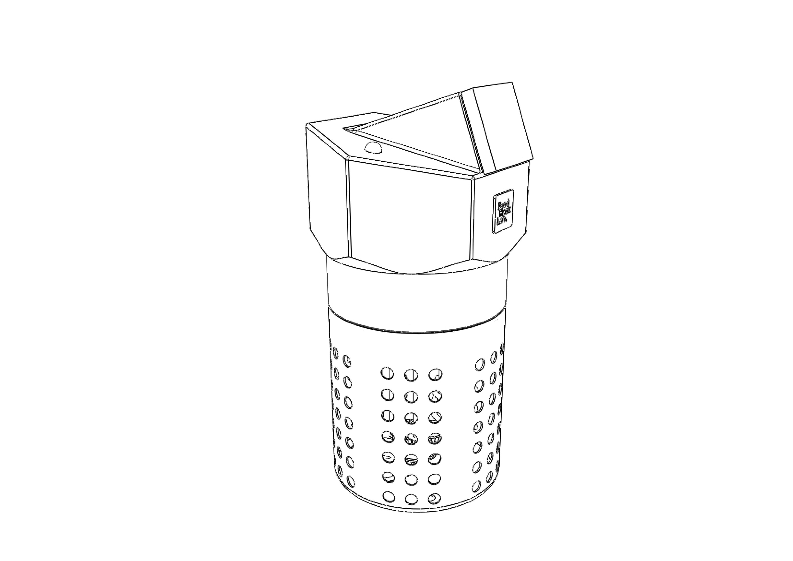

# SousVide
TIC (Thermal Inmersion Circulator) / Sous Vide Machine for Low temperature Cooking

This is version V1.0: the first version that included 3D printed files of the TIC we worked on.
We did several prototypes before getting to this 3D printed design, all of them made by a laser-cutting machine (not worth to be shared). 

This version was intended to be the first 3D printed one, once the functional aspects were tested in the previous prototypes. 

This version includes:

- 1 PID Controller + Temperature Sensor.
- 1 Solid State Relay.
- 1 Power Switch.
- 1 Power Supply Plug. 
- 1 ON/OFF Indicator LED.
- 1 Mixer Motor.
- (+1 AC-DC converter to convert the AC power to DC for the Mixer Motor).
- 2 Water Heater Resistors (the ones usually used to make tea on a Camping). 
- 1 Axis (for the mixer).
- Common IKEA Cutterly pot. 
- 3D Printed Parts:
  - UI_Shell_V1.0
  - Main_Shell_V1.0
  - Mixer Helix_V1.0
- Some welding and wiring is needed.
  
*NOTE that every component was chosen and designed according to our needs at the moment (some of the parts designs have been modelled and not precisely designed for that matter). The 3D files are uploaded for anyone who can make changes and adapt them to their own needs or available parts. 

